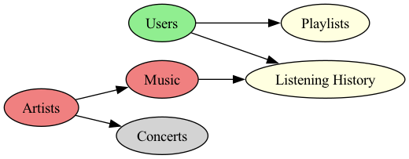

# Aplikacja muzyczna na DynamoDB

Przykład implementacji systemu muzycznego podobnego do Spotify, używający AWS DynamoDB jako bazy danych. Pokazuje jak zaprojektować skalowalne tabele, stworzyć efektywne indeksy i napisać zapytania dla typowych scenariuszy użycia.

## 📖 Dokumentacja

- **[AWS_SETUP_INSTRUCTIONS.md](AWS_SETUP_INSTRUCTIONS.md)** - Krok po kroku: od rejestracji AWS do pierwszego uruchomienia
- **[CODE_EXPLANATION.md](CODE_EXPLANATION.md)** - Szczegółowe wyjaśnienie architektury i wzorców DynamoDB

## 🚀 Szybki start

**Masz już AWS i Python?** Wystarczy:

```bash
cd AWS_DynamoDB
pip install -r requirements.txt
aws configure  # jeśli nie robiłeś wcześniej
python main.py
```

### Jakie tabele powstają

| Tabela               | Klucz główny | Klucz sortujący | Czego dotyczy          |
| -------------------- | ------------ | --------------- | ---------------------- |
| Users                | user_id      | -               | Profile użytkowników   |
| Artists              | artist_id    | -               | Informacje o artystach |
| Music                | Artist       | SongTitle       | Katalog utworów        |
| Playlists            | playlist_id  | -               | Playlisty użytkowników |
| UserListeningHistory | user_id      | timestamp       | Historia odtworzeń     |
| Concerts             | concert_id   | -               | Wydarzenia muzyczne    |



**Szybka pomoc:**

- `aws configure list` - sprawdź konfigurację AWS
- Region musi być `eu-north-1` wszędzie
- "Table already exists" to nie błąd - skrypt jest bezpieczny
- Na macOS: `brew reinstall graphviz` jeśli diagramy nie działają

**Koszty:** Wszystko mieści się w darmowym AWS Free Tier (25GB DynamoDB miesięcznie).

---
